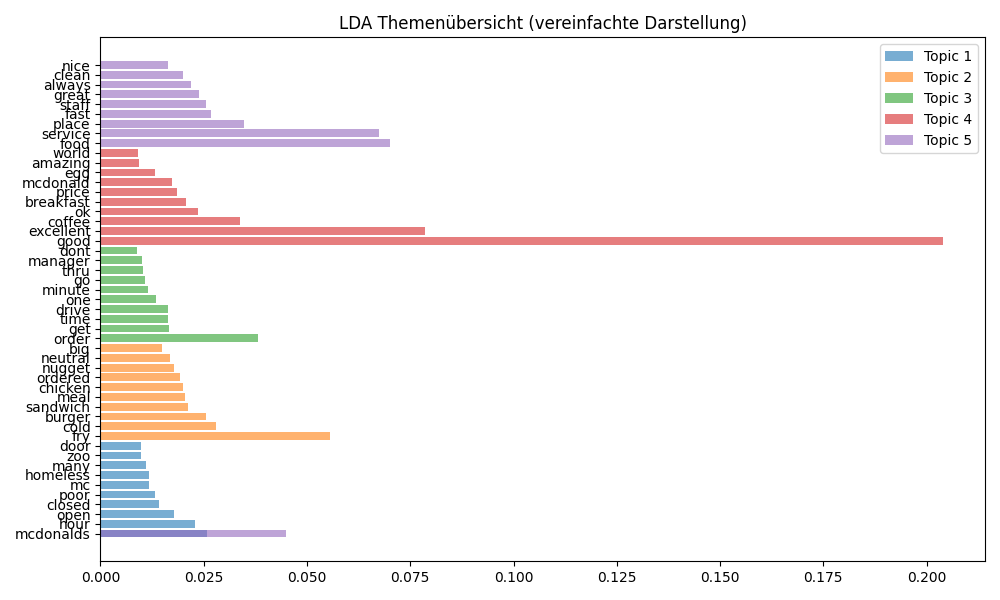

# mcdonalds-review-nlp  
# 🍔 McDonald's Review NLP Analysis  

🧠 NLP Textanalyse – McDonald’s Reviews (IU Projekt: Data Analysis)  

Dieses Projekt wurde im Rahmen des IU-Fernstudiums Cyber Security im Modul Projekt: Data Analysis umgesetzt.  
Ziel war es, mithilfe von Natural Language Processing (NLP) unstrukturierte Textdaten automatisiert zu analysieren und daraus Themen und Stimmungen zu erkennen.  

## 📖 Projektbeschreibung  
Dieses Projekt wurde im Rahmen des IU-Moduls **"Projekt Data Analysis"** erstellt. Ziel ist es, mit NLP-Techniken die häufigsten Themen und Stimmungen aus über **33.000 McDonald's Google Reviews** aus den USA zu extrahieren. Das Projekt orientiert sich methodisch an der Aufgabenstellung, bei der ursprünglich Beschwerden aus einer Kommune analysiert werden sollten. Die Daten enthalten zahlreiche Kundenbeschwerden, Kritikpunkte und Feedback, die methodisch ähnliche Strukturen aufweisen wie die im Szenario beschriebenen kommunalen Beschwerdedaten.

## 🎯 Ziele  
- Extraktion häufig genannter Themen (Topic Modeling)  
- Erkennung der allgemeinen Stimmung (Sentiment Analysis)  
- Analyse von Mustern in Bewertungen (z. B. Zusammenhang zwischen Text und Sternebewertung)  
- Erkennung wiederkehrende Themen durch LDA-Topic-Modeling  
- Erweiterte Sentiment-getrennte Themenanalyse  
- Aufbereitung der Ergebnisse in visueller und interpretativer Form  

## 🧰 Methodik und Tools  
### Programmiersprache  
- **Python** 3.9  
### Verwendete Bibliotheken  
- **Pandas**, **NumPy** – Datenaufbereitung  
- **NLTK**, **spaCy** – Textverarbeitung, NLP (Tokenisierung, Lemmatisierung, Stopwords)  
- **scikit-learn**, **gensim** –  Vektorisierung und Topic Modeling  
- **Matplotlib**, **pyLDAvis** – Visualisierung  

## 🗂️ Projektstruktur  
- **mcdonalds-nlp-analysis/**  
  - **data/**  
    - mcdonalds_reviews.csv  
  - **notebooks/**  
    - analysis.ipynb  
  - **outputs/**  
    - lda_topics_negative reviews  
    - lda_topics_positive reviews  
    - lda_topics_sentiment_combined  
    - lda_topics.csv  
    - lda_visualization.html  
    - lda_visualization.png  
    - sentiment_vs_rating.png  
    - top20_words.png  
    - verarbeitete_daten.csv  
  - requirements.txt  
  - README.md  

## 📊 Datensatz  
**Quelle:** Kaggle – [McDonald's Store Reviews Dataset](https://www.kaggle.com/)  
**Umfang:** 33.000+ Google Reviews von McDonald’s Filialen in den USA  
**Spalten:**  
- `reviewer_id` – Anonymisierte ID des Rezensenten  
- `store_name`, `store_address` – Standortdaten  
- `review` – Text der Bewertung  
- `rating` – Bewertungsstern (1–5)  
- `review_time` – Zeitpunkt der Bewertung  

## 📈 Analyse-Schritte:  
1.	Datenbereinigung: Entfernen von Sonderzeichen, URLs, Zahlen, Stopwords  
2.	Tokenisierung & Lemmatisierung: Vereinheitlichung der Wortformen  
3.	Sentiment-Analyse: Bewertung der Textstimmung (negativ → positiv)  
4.	Topic Modeling (LDA): Extraktion der häufigsten Themen  
5.	Evaluation: Optimierung mit Coherence Score  
6.	Trennung von positiven und negativen Reviews (Sentiment-getrennte Themenanalyse)  

## 📊 Ergebnisse  

Top 5 identifizierte Themen:  
	1.	Bestell- und Wartezeiten („hour“, „order“, „time“)  
	2.	Service und Sauberkeit („friendly“, „clean“, „staff“, „good“)  
	3.	Negative Erfahrungen („terrible“, „dirty“, „fry“)  
	4.	Positive Erlebnisse („happy“, „excellent“, „meal“)  
	5.	Drive-Thru & Kundenservice („rude“, „manager“, „line“, „drive“)  

Sentiment-Ergebnisse (Durchschnitt je Sternebewertung):  
Bewertung	Sentiment-Durchschnitt  
⭐ 1		−0.20  
⭐ 2		−0.08  
⭐ 3		+0.10  
⭐ 4		+0.38  
⭐ 5		+0.52  

Auswertung der Trennung von positiven und negativen Reviews:  
Bei den positiven Reviews kam folgen Hauptthemen Service & Sauberkeit, Personalinteraktion und Qualität & Zuverlässigkeit vor. Gäste loben somit freundliche Mitarbeiter, saubere Filialen und kon-stant gute Qualität.  
Bei den negativen Reviews war der Fokus auf Essen & Temperatur, Hygiene & Umfeld, Wartezei-ten & Organisation. Somit richten sich die Beschwerden an kaltes Essen, unsaubere Filialen und lange Wartezeiten.  

## 📊 Screenshots & Output Vorschau  

### Top 20 häufigste Wörter  

### Durchschnittliches Sentiment pro Bewertung  

### LDA Themenübersicht (vereinfachte Darstellung)  

### Interaktive LDA Visualisierung  
Öffne die interaktive HTML-Datei:  
[lda_visualization.html](outputs/lda_visualization.html)

## 💬 Reflexion  
Dieses Projekt zeigt, wie NLP-Methoden helfen können, große Mengen unstrukturierter Texte effizient zu analysieren. Die Kombination aus Sentiment-Analyse und Topic Modeling liefert wertvolle Einblicke in Kundenmeinungen und ermöglicht datenbasierte Entscheidungen – sowohl im privaten Sektor als auch in kommunalen Kontexten.  

## 👨‍💻 Installation und Features  

### Features  
1.	Datenaufbereitung & Bereinigung  
	•	Einlesen von CSV-Dateien mit Reviews  
	•	Bereinigung der Texte: Entfernen von Sonderzeichen, Zahlen und URLs  
	•	Tokenisierung und Lemmatisierung  
	•	Speichern der verarbeiteten Daten (verarbeitete_daten.csv)  
2.	Explorative Analyse  
	•	Häufigkeitsanalyse der Wörter  
	•	Darstellung der Top 20 Wörter als Balkendiagramm  
	•	Berechnung von Sentiment-Werten (Polarity -1 bis +1)  
	•	Visualisierung der Sentiment-Verteilung  
	•	Durchschnittliche Sentiments nach Sternebewertungen  
3.	Topic Modeling  
	•	LDA (Latent Dirichlet Allocation) zur Themenextraktion  
	•	Anzeige der Top 10 Wörter pro Thema  
	•	Interaktive LDA-Visualisierung mit pyLDAvis  
	•	Themen als CSV-Datei speichern (lda_topics.csv)  
4.	Automatisiertes Speichern  
	•	Alle Plots (Top-Wörter, Sentiment vs Rating, LDA Übersicht) werden automatisch im outputs/ Ordner abgelegt
5.	Kompatibilität & Umgebung  
	•	Virtuelle Umgebung empfohlen  
	•	Python 3.9+ empfohlen  
	•	Alle benötigten Bibliotheken in requirements.txt gelistet  

### Installation  
1.	Repository klonen:  
git clone <REPO_URL>  
cd <REPO_NAME>  

2.	Virtuelle Umgebung erstellen:  
python3 -m venv venv  
source venv/bin/activate      # macOS/Linux  
venv\Scripts\activate         # Windows  

3.	Abhängigkeiten installieren:  
pip install -r requirements.txt  

4.	Notebook starten:  
jupyter notebook  

### Nutzung  
	1.	Die Rohdaten in ../data/mcd_reviews.csv ablegen  
	2.	Notebook starten: mcd_reviews_analysis.ipynb  
	3.	Alle Zeilen nacheinander ausführen  
	4.	Ergebnisse & Visualisierungen befinden sich im outputs/ Ordner  

### Beispielausgaben  

Top-Wörter in Reviews:  
food, order, service, mcdonalds, good, place, get, time, one, drive  

Themen aus LDA:  
Thema 1: mcdonalds, hour, open, closed, poor, mc, homeless, many, zoo, door  
Thema 2: fry, cold, burger, sandwich, meal, chicken, ordered, nugget, neutral, big  
Thema 3: order, get, time, drive, one, minute, go, thru, manager, dont  
Thema 4: good, excellent, coffee, ok, breakfast, price, mcdonald, egg, amazing, world  
Thema 5: food, service, mcdonalds, place, fast, staff, great, always, clean, nice  

Durchschnittliches Sentiment pro Bewertung:  
1 Sterne: -0.20  
2 Sterne: -0.08  
3 Sterne: 0.10  
4 Sterne: 0.38  
5 Sterne: 0.52  

Positive Reviews – LDA-Modell trainiert:  
Thema 1: service, great, fast, excellent, food, place, clean, nice, staff, friendly  
Thema 2: ok, manager, said, asked, egg, didnt, door, pm, told, employee  
Thema 3: good, order, food, mcdonalds, time, always, get, drive, like, hot  

Negative Reviews – LDA-Modell trainiert:  
Thema 1: fry, poor, cold, terrible, mcdonalds, food, chicken, ordered, worst, sandwich  
Thema 2: dirty, mcdonalds, place, table, mc, people, like, bathroom, homeless, area  
Thema 3: order, service, food, drive, minute, customer, get, time, bad, slow  

### Anforderungen  
	•	Python 3.9+  
	•	Bibliotheken siehe requirements.txt  

### Hinweise  
	•	Bei NLTK müssen die Ressourcen punkt, wordnet, stopwords und omw-1.4 heruntergeladen werden  
	•	Bei pyLDAvis kann ein HTML-Dashboard interaktiv geöffnet werden  
	•	Alle Outputs werden automatisch gespeichert, sodass das Notebook jederzeit neu ausgeführt werden kann, ohne manuelle Anpassungen  

## 📚 Quellen  
	•	Datensatz: McDonald’s Store Reviews (Kaggle)  
	•	Bibliotheken: NLTK, gensim, scikit-learn  
	•	Lehrmaterial: IU Modul „Projekt: Data Analysis“  
  
## 👤 Autor  
Louis Sagstetter  
IU – Projektarbeit im Kurs *Projekt: Data Analysis*  
